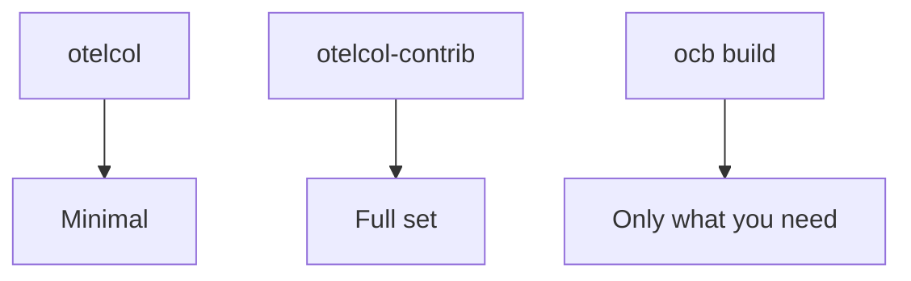

# Collector Distributions

## What It Is
A **Collector distribution** is a prebuilt binary bundling a specific set of components. You choose one based on the receivers/processors/exporters you need.

## Why It Exists
Bundling only needed components keeps the binary small and secure. Different distributions serve different needs.

## Common Distributions
| Distribution | Contents |
|--------------|----------|
| `otelcol` (core) | Stable, minimal components |
| `otelcol-contrib` | 100+ components (recommended) |
| `otelcol-k8s` | Contrib + k8s-native components |
| Vendor builds | Datadog, Splunk, AWS, Grafana, etc. |
| Custom (`ocb`) | Build your own with the Collector Builder |

## Architecture


## When to Use It
- Start with **contrib** for breadth
- Use **core** for minimal/stable needs
- Use **custom (ocb)** for lean, secure production images

## Code Example (build custom)
```bash
builder --config=builder.yaml --output-path=./otelcol-custom
```

## Best Practices
- Pin the distribution version
- Reduce attack surface with custom builds in production
- Verify component availability before referencing it

## Related Concepts
- [otelcol](otelcol.md)
- [Config](config.md)
