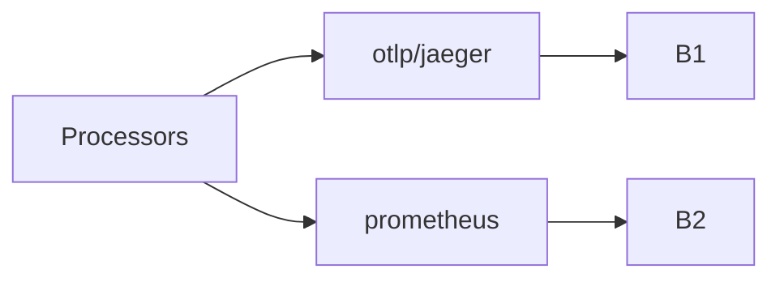

# Exporters — Deep Dive

## What It Is
Production **exporter patterns**: fan-out, queueing, retry, and OTLP between tiers.

## Why It Exists
Exporters are where data actually leaves your control; configuring them for reliability and cost matters.

## Patterns
### Fan-out to multiple backends
```yaml
exporters:
  otlp/jaeger: { endpoint: jaeger:4317 }
  prometheus:  { endpoint: 0.0.0.0:8889 }
  loki:        { endpoint: http://loki:3100/loki/api/v1/push }
service:
  pipelines:
    traces: { exporters: [otlp/jaeger, debug] }
    metrics: { exporters: [prometheus] }
    logs: { exporters: [loki] }
```
### Agent → Gateway (OTLP only)
```yaml
exporters:
  otlp/gateway: { endpoint: gateway.otel.svc:4317, tls: { insecure: false } }
```

## Reliability
- Most exporters include **retry** + **sending queue**
- Use `batch` before exporters to improve throughput
- Monitor exporter failures (see telemetry)

## Architecture


## Best Practices
- Centralize exporters in the gateway
- Use OTLP between tiers; backend-specific at the edge
- Secure gateway exporters (TLS/mTLS)

## Related Concepts
- [Exporters (arch)](../02-architecture/exporters.md)
- [Exporters & Backends](../10-exporters-backends/README.md)
- [Scaling](scaling.md)
