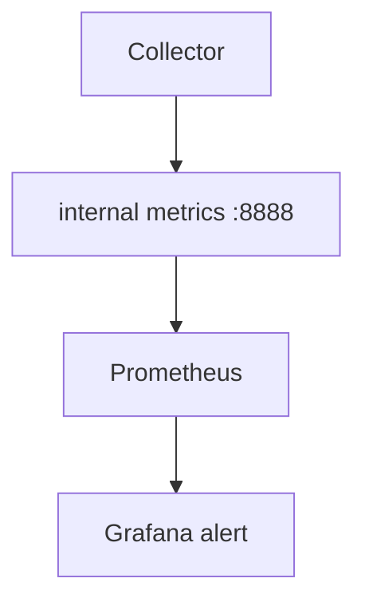

# Observability of the Collector

## What It Is
Monitoring the **Collector itself** — its internal metrics, health, and zpages — so you know when it is dropping or failing to export data.

## Why It Exists
The Collector is infrastructure; if it silently drops spans, you lose visibility with no warning.

## Signals to Watch
| Signal | Metric / Endpoint |
|--------|-------------------|
| Liveness/readiness | `health_check` `:13133` |
| Export failures | `otelcol_exporter_send_failed_spans` |
| Queue depth | `otelcol_exporter_queue_size` |
| Dropped (memory) | `otelcol_processor_dropped_spans` |
| Collector metrics | `otelcol_processor_*`, `receiver_*`, `exporter_*` |

## Architecture


## When to Use It
- Always in production
- Pair with alerts on `send_failed_*` and `dropped_*`

## Code Example
```yaml
service:
  telemetry:
    metrics:
      address: 0.0.0.0:8888
  extensions: [health_check]
```

## Best Practices
- Scrape Collector's own metrics
- Alert on dropped/export-failed > 0
- Use `zpages`/`pprof` for live debugging

## Related Concepts
- [Scaling](scaling.md)
- [Extensions (arch)](../02-architecture/extensions.md)
