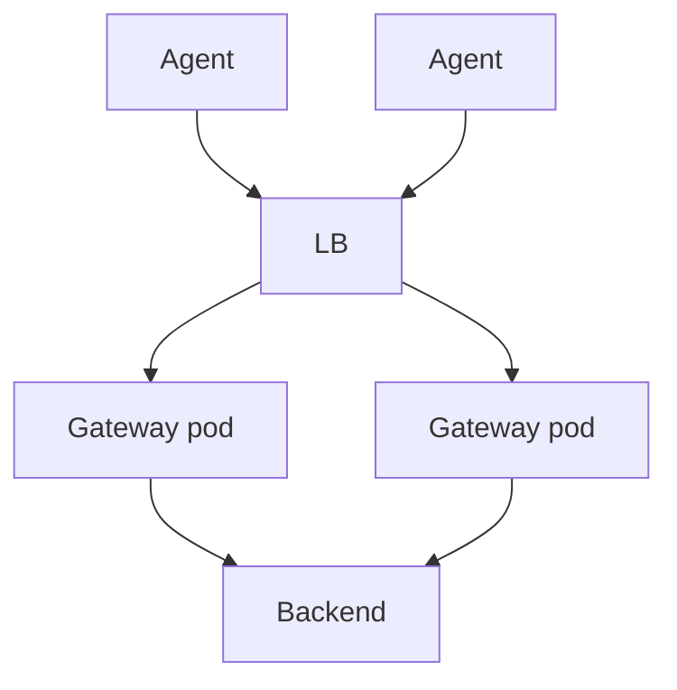

# Scaling the Collector

## What It Is
Strategies to run the Collector **reliably at scale** — resource limits, horizontal scaling, and backpressure handling.

## Why It Exists
A Collector is a stateful-ish buffer; undersized or oversized instances drop data or waste resources.

## Strategies
| Strategy | Detail |
|----------|--------|
| `memory_limiter` | Hard cap → drop data instead of OOM |
| HPA on gateway | Scale on CPU / queue size |
| Sharding | Partition by service/tenant |
| Load balancer | Spread agents across gateways |
| `batch` tuning | Larger batches = less overhead |

## Architecture (scaled gateway)


## When to Use It
- High-volume production (>> 1k spans/sec)
- Multi-tenant or multi-region

## Code Example (HPA)
```yaml
apiVersion: autoscaling/v2
kind: HorizontalPodAutoscaler
spec:
  scaleTargetRef: { kind: Deployment, name: otel-gateway }
  minReplicas: 3
  maxReplicas: 20
  metrics: [{ type: Resource, resource: { name: cpu, target: { averageUtilization: 70 } } }]
```

## Best Practices
- Always set `memory_limiter`
- Use a load balancer in front of gateways
- Monitor queue depth and export failures

## Related Concepts
- [Observability of Collector](observability-of-collector.md)
- [Deployment Modes](../02-architecture/deployment-modes.md)
