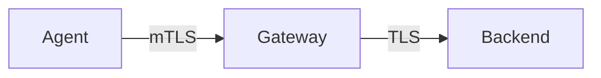

# Collector Security

## What It Is
Hardening the Collector: **TLS**, **authentication**, **authorization**, and secret handling.

## Why It Exists
Telemetry can contain sensitive data (PII in attributes, URLs with tokens). The Collector must be secured in transit and at the edge.

## Controls
| Control | How |
|---------|------|
| TLS (in/receiver) | `tls: { cert_file, key_file }` |
| mTLS agent→gateway | client certs on exporters |
| Auth (receiver) | `basicauth`, `bearertokenauth`, `oidc` extensions |
| Auth (exporter) | per-backend credentials |
| Secrets | env substitution `${env:TOKEN}` |
| Network | restrict ports; internal-only |

## Example (secured receiver)
```yaml
receivers:
  otlp:
    protocols:
      grpc:
        endpoint: 0.0.0.0:4317
        tls: { cert_file: /certs/tls.crt, key_file: /certs/tls.key }
extensions:
  basicauth/otlp:
    client_auth: { users: [{ username: agent, password: ${env:AGENT_PW} }] }
```

## Architecture


## Best Practices
- Terminate TLS; use mTLS between tiers
- Never hardcode secrets — use env/secret stores
- Restrict `health_check`/`pprof` to internal networks
- Redact secrets with the `attributes` processor

## Related Concepts
- [Processors Deep](processors-deep.md)
- [Extensions (arch)](../02-architecture/extensions.md)
- [Troubleshooting](../15-troubleshooting/README.md)
