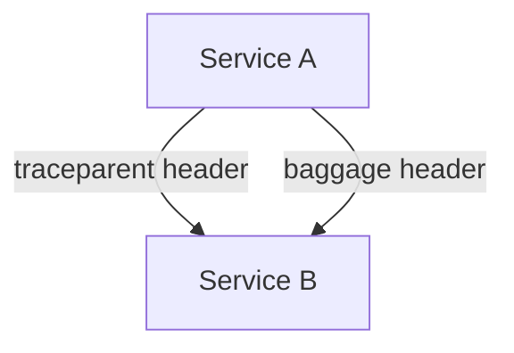

# 07 · Context Propagation

> How the active trace/span (and custom baggage) travels **across process and service boundaries** using standard propagators. This is what makes distributed tracing work.

## Topics in this section

| Document | Summary |
|----------|---------|
| [trace-context.md](trace-context.md) | W3C `traceparent` / `tracestate` |
| [baggage.md](baggage.md) | Custom key-values that propagate |
| [propagators.md](propagators.md) | Inject / extract abstraction |
| [b3.md](b3.md) | Zipkin B3 propagator |
| [composite-propagators.md](composite-propagators.md) | Multiple formats at once |
| [cross-process.md](cross-process.md) | Propagation across transports |

See the [main README](../README.md) for the full map.
