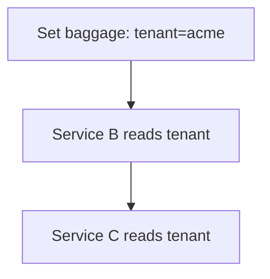

# Baggage

## What It Is
**Baggage** is a set of **custom key-value pairs** that propagate alongside the trace context to any service in the path.

## Why It Exists
Sometimes you need to carry application data (tenant id, feature flag, request priority) across services without putting it in every span attribute manually. Baggage automates that.

## Characteristics
- Propagates via the `baggage` HTTP header
- Can be automatically added as span attributes (via the baggage span processor)
- Higher overhead than trace context (on every request)

## Architecture


## When to Use It
- Carry a few important, low-volume values (tenant, ab-test)
- Avoid high-cardinality or large values

## Code Example (Python)
```python
from opentelemetry.baggage import set_baggage, get_baggage
set_baggage("tenant", "acme")
print(get_baggage("tenant"))  # accessible downstream
```

## Best Practices
- Keep baggage small and few
- Don't put secrets in baggage
- Use the `baggage` span processor to promote to attributes

## Related Concepts
- [Propagators](propagators.md)
- [Composite Propagators](composite-propagators.md)
- [Attributes (core)](../01-core-concepts/attributes.md)
