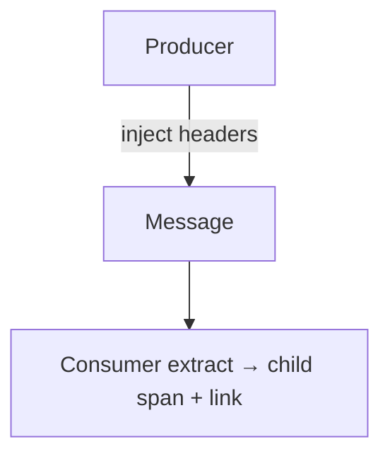

# Cross-Process Propagation

## What It Is
**Cross-process propagation** is carrying context across **any** inter-process transport — HTTP, gRPC, messaging (Kafka, RabbitMQ), or custom protocols.

## Why It Exists
Distributed systems use many transports; each needs context injected/extracted correctly or the trace breaks.

## Transports
| Transport | Carrier |
|-----------|---------|
| HTTP | `traceparent` header |
| gRPC | Metadata |
| Kafka | Message headers |
| AMQP/RabbitMQ | Message properties |
| Custom | Manual inject/extract |

## Architecture


## When to Use It
- Every outbound/inbound boundary
- Messaging: extract at consumer; consider **Links** for async

## Code Example (Kafka header inject, Python)
```python
headers = {}
inject(headers)  # adds traceparent
producer.send("topic", value=payload, headers=[(k, v.encode()) for k,v in headers.items()])
```

## Best Practices
- Use auto-instrumentation for supported clients
- For messaging, also add a **Link** to the producer trace
- Verify context survives every transport in the path

## Related Concepts
- [Propagators](propagators.md)
- [Links](../03-traces/links.md)
- [Distributed Tracing](../03-traces/distributed-tracing.md)
