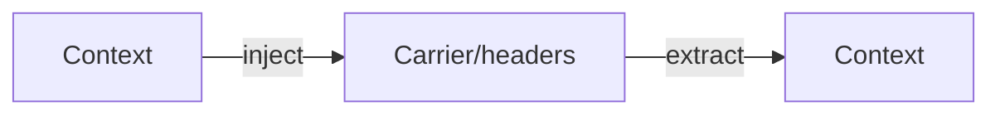

# Propagators

## What It Is
A **Propagator** is the abstraction that **injects** and **extracts** context (trace context + baggage) from carriers like HTTP headers, messages, or gRPC metadata.

## Why It Exists
Different transports need different injection logic. Propagators hide that behind `inject()` / `extract()` so instrumentation is transport-agnostic.

## API


## Operations
- **inject(ctx, carrier)** — write context into outgoing carrier
- **extract(carrier)** — read context from incoming carrier → new context

## When to Use It
- Automatic for supported frameworks
- Manual for custom protocols/transports

## Code Example (Python)
```python
from opentelemetry.propagate import inject, extract
headers = {}
inject(headers)                      # outgoing
ctx = extract(incoming_headers)      # incoming
```

## Best Practices
- Configure a single global propagator set
- Prefer W3C Trace Context as primary
- Combine with B3 only if legacy systems require it

## Related Concepts
- [Trace Context](trace-context.md)
- [B3](b3.md)
- [Composite Propagators](composite-propagators.md)
