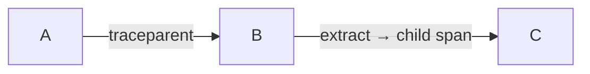

# W3C Trace Context

## What It Is
**W3C Trace Context** is the standard (`traceparent` + `tracestate` headers) for propagating trace identity across services. It is the **default OTel propagator**.

## Why It Exists
Before a standard, each tracing system used proprietary headers, breaking traces across vendors. W3C Trace Context is vendor-neutral and universally supported.

## Headers
```
traceparent: 00-4bf92f3577b34da6a3ce929d0e0e4736-00f067aa0ba902b7-01
              └ver┘└───────trace_id───────┘└────span_id──────┘└flags┘

tracestate: vendor1=value1,vendor2=value2
```
- `flags` `01` = sampled
- `tracestate` carries vendor-specific data without breaking the chain

## Architecture


## When to Use It
- Default for all cross-service calls
- Interop with Jaeger/Tempo/Datadog/etc.

## Best Practices
- Use as the primary propagator
- Don't put secrets in `tracestate`
- Keep `tracestate` small (some systems truncate)

## Related Concepts
- [Propagators](propagators.md)
- [Span Context](../03-traces/span-context.md)
- [Composite Propagators](composite-propagators.md)
