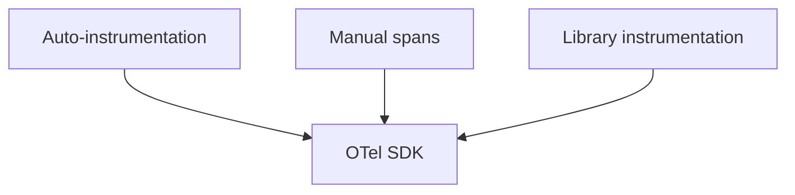

# 08 · Instrumentation

> How to actually capture telemetry: **manual** API calls, **automatic (zero-code)** agents, library instrumentation, web, mobile, and eBPF-based approaches.

## Topics in this section

| Document | Summary |
|----------|---------|
| [manual.md](manual.md) | Calling the API directly |
| [auto-zero-code.md](auto-zero-code.md) | Agents that instrument without code |
| [libraries.md](libraries.md) | Prebuilt instrumentation for frameworks |
| [web.md](web.md) | Browser/JS instrumentation |
| [mobile.md](mobile.md) | Android/iOS |
| [ebpf.md](eBPF.md) | Kernel-level, code-free capture |
| [instrumentation-best-practices.md](instrumentation-best-practices.md) | Combining approaches |
| [migration.md](migration.md) | Moving from vendor SDKs to OTel |

See the [main README](../README.md) for the full map.
