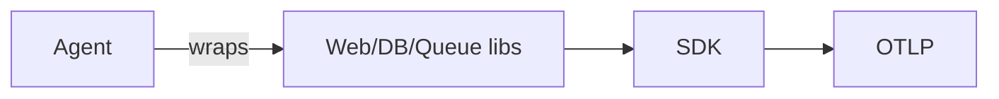

# Auto / Zero-Code Instrumentation

## What It Is
**Auto-instrumentation** captures telemetry from supported libraries/frameworks **without changing source code**, via an agent or wrapper.

## Why It Exists
Fast, broad coverage with near-zero effort — ideal for onboarding many services.

## Language Mechanisms
| Lang | Command |
|------|---------|
| Java | `-javaagent:opentelemetry-javaagent.jar` |
| Python | `opentelemetry-instrument python app.py` |
| Node | `-r @opentelemetry/instrumentation` |
| .NET | `OpenTelemetry.AutoInstrumentation` |
| Go | limited (code-based) / eBPF |

## Architecture

## When to Use It
- Initial onboarding, fast coverage
- Standard frameworks (HTTP, DB, messaging)

## Best Practices
- Pin agent versions
- Combine with manual for business spans
- Use OTel Operator for K8s injection

## Related Concepts
- [Manual](manual.md)
- [Libraries](libraries.md)
- [Kubernetes Deployment](../13-kubernetes-deployment/README.md)
