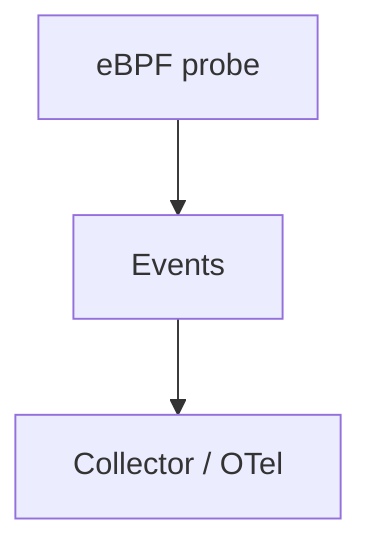

# eBPF Instrumentation

## What It Is
**eBPF-based instrumentation** captures telemetry **from the Linux kernel** (syscalls, network, HTTP) without modifying or even restarting the application.

## Why It Exists
Some workloads (uninstrumentable binaries, legacy apps, CGO) can't use SDKs. eBPF provides code-free, language-agnostic observability at the kernel level.

## What It Can Capture
- Network flows (TCP/HTTP) → derived spans
- Syscall latency
- File/disk I/O
- Limited payload/header context for trace propagation

## Architecture

## When to Use It
- Legacy/uninstrumentable services
- Supplementary network-level spans
- Security/performance at the kernel

## Caveats
- Linux-only; needs privileges (CAP_BPF)
- Less semantic detail than SDK spans
- Complements, not replaces, SDK instrumentation

## Related Concepts
- [Auto / Zero-Code](auto-zero-code.md)
- [Profiling](../12-profiling/README.md)
- [Go Instrumentation](../09-language-sdks/go.md)
