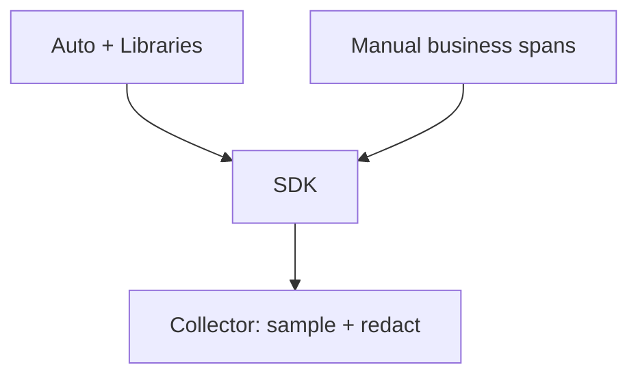

# Instrumentation Best Practices

## What It Is
How to combine manual, auto, and library instrumentation for maximum coverage with minimal noise and cost.

## Why It Exists
Random instrumentation yields gaps and overhead. A strategy yields consistent, actionable telemetry.

## Strategy
1. **Auto-instrument** all standard frameworks (fast breadth)
2. **Add libraries** for the dependencies you use
3. **Manual spans** for business-critical flows
4. **Sample** to control volume
5. **Correlate** traces ↔ logs ↔ metrics

## Architecture

## Recommendations
- One consistent `service.name` per deployable
- Don't double-instrument (agent + manual for same call)
- Set resource attributes from environment
- Validate with `debug` exporter early

## Common Pitfalls
| Pitfall | Fix |
|---------|-----|
| Double spans | Use only one mechanism per call |
| Missing coverage | Add the right library |
| Overhead | Enable sampling |

## Related Concepts
- [Manual](manual.md)
- [Auto / Zero-Code](auto-zero-code.md)
- [Migration](migration.md)
