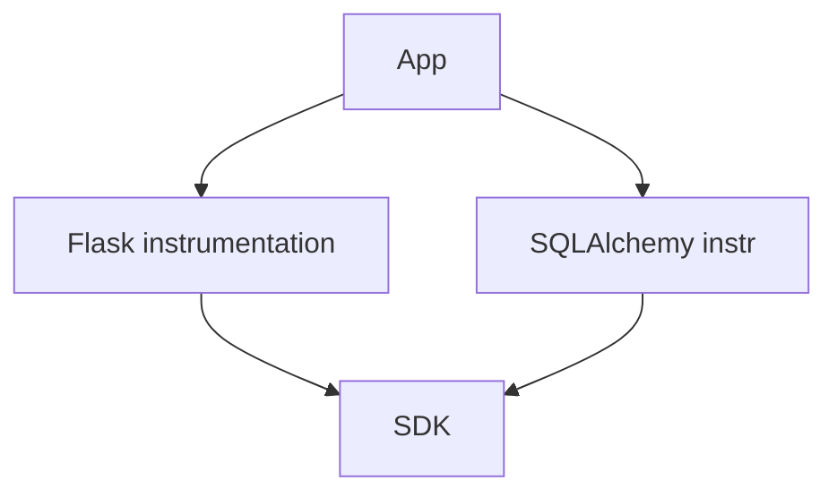

# Library Instrumentation

## What It Is
**Library (instrumentation) packages** provide ready-made spans/metrics for specific frameworks and libraries (e.g., Flask, SQLAlchemy, Express, JDBC, grpc).

## Why It Exists
Re-implementing instrumentation per app is wasteful; shared libraries give consistent, maintained coverage.

## Examples
| Ecosystem | Libraries |
|-----------|-----------|
| Python | `opentelemetry-instrumentation-flask`, `-sqlalchemy`, `-requests` |
| Java | `opentelemetry-spring-boot-starter`, `-jdbc` |
| Node | `@opentelemetry/instrumentation-express`, `-pg` |
| .NET | `OpenTelemetry.Instrumentation.AspNetCore` |

## Architecture


## When to Use It
- Almost always alongside auto-instrumentation
- When you need a specific library covered

## Code Example (Python)
```bash
pip install opentelemetry-instrumentation-flask
opentelemetry-instrument python app.py
```

## Best Practices
- Install the matching instrumentation per dependency
- Keep them version-aligned with the SDK
- Prefer official over community where both exist

## Related Concepts
- [Auto / Zero-Code](auto-zero-code.md)
- [Language SDKs](../09-language-sdks/README.md)
