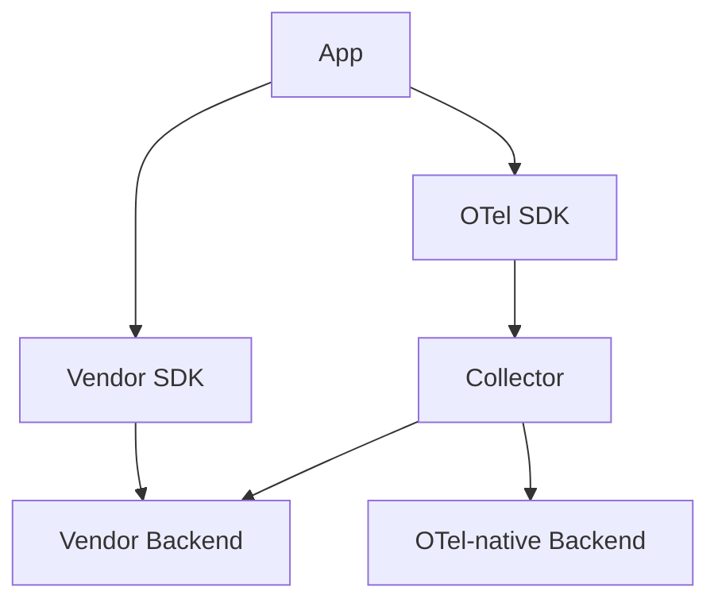

# Migration to OpenTelemetry

## What It Is
**Migration** is moving from a vendor-specific SDK (Datadog, New Relic, Jaeger client) or homegrown instrumentation to OpenTelemetry.

## Why It Exists
Teams adopt OTel to remove lock-in and unify telemetry. Migration must be low-risk and incremental.

## Approach (strangler pattern)

1. Deploy Collector alongside existing pipeline
2. Add OTel SDK (dual-emit or replace)
3. Validate parity in dashboards
4. Cut over exporters to OTel backend
5. Remove vendor SDK

## When to Use It
- Reducing vendor lock-in
- Standardizing across teams

## Best Practices
- Run both during transition (dual emit)
- Use Collector exporters to mirror data
- Migrate service-by-service
- Keep semantic conventions consistent

## Common Issues & Solutions
| Issue | Fix |
|-------|-----|
| Attribute name drift | Adopt semconv before cutover |
| Cost spike (dual) | Sample during transition |

## Related Concepts
- [Exporters & Backends](../10-exporters-backends/README.md)
- [Semantic Conventions](../11-semantic-conventions/README.md)
