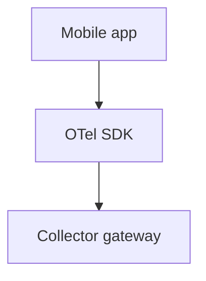

# Mobile Instrumentation

## What It Is
**Mobile instrumentation** brings OTel to Android (Java/Kotlin) and iOS (Swift/ObjC) apps — capturing crashes, network calls, and user journeys.

## Why It Exists
Mobile clients are a major source of latency and errors; OTel provides a consistent SDK for these platforms.

## Platforms
| Platform | SDK |
|----------|-----|
| Android | `opentelemetry-android` / OpenTelemetry Java |
| iOS | `opentelemetry-swift` |

## Architecture

## When to Use It
- Native mobile apps needing observability
- Correlating client errors with backend

## Best Practices
- Export via a Collector gateway (don't expose backend creds)
- Respect user privacy / sampling
- Capture crashes via integration hooks

## Related Concepts
- [Web Instrumentation](web.md)
- [Language SDKs](../09-language-sdks/README.md)
- [Collector Security](../06-collector/security.md)
