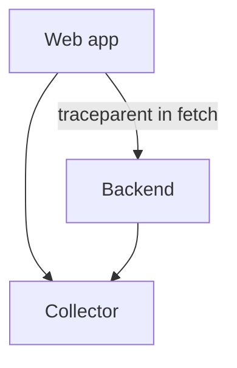

# Web / Browser Instrumentation

## What It Is
**Web (browser) instrumentation** captures frontend telemetry — page loads, fetch/XHR calls, user interactions — and links it to backend traces via W3C context.

## Why It Exists
User-perceived latency lives in the browser. Frontend OTel closes the loop between "click" and "response," including the network and backend portions.

## Capabilities
- Document/page load timing
- `fetch`/`XMLHttpRequest` auto-instrumentation
- User interaction events
- Propagates `traceparent` to backend (end-to-end trace)
- Long-task / Web Vitals contributions

## Architecture


## When to Use It
- SPAs and any user-facing web app
- Correlating frontend errors with backend traces

## Code Example
```js
import { OTLPTraceExporter } from '@opentelemetry/exporter-trace-otlp-http';
import { WebTracerProvider } from '@opentelemetry/sdk-trace-web';
const provider = new WebTracerProvider();
provider.register();
```

## Best Practices
- Export to Collector (not directly to backend) — browsers are public
- Sample to control volume from many clients
- Enable `traceparent` propagation on `fetch`

## Related Concepts
- [Trace Context](../07-context-propagation/trace-context.md)
- [Distributed Tracing](../03-traces/distributed-tracing.md)
