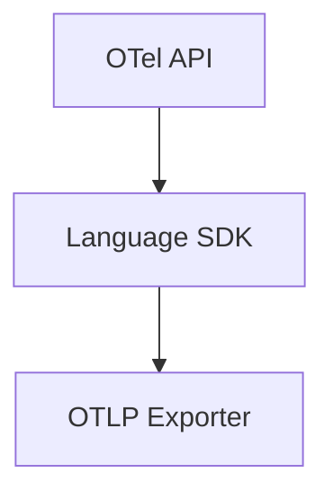

# 09 · Language SDKs

> OpenTelemetry provides **first-class SDKs** for many languages. This section covers setup, idioms, and gotchas for each supported language.

## Topics in this section

| Document | Summary |
|----------|---------|
| [go.md](go.md) | `go.opentelemetry.io/otel` |
| [python.md](python.md) | `opentelemetry-python` |
| [java.md](java.md) | `opentelemetry-java` + agent |
| [js-ts.md](js-ts.md) | JS/TS (`@opentelemetry/*`) |
| [dotnet.md](dotnet.md) | `OpenTelemetry .NET` |
| [rust.md](rust.md) | `opentelemetry-rust` |
| [cpp.md](cpp.md) | `opentelemetry-cpp` |
| [ruby.md](ruby.md) | `opentelemetry-ruby` |
| [php.md](php.md) | `opentelemetry-php` |
| [stability-matrix.md](stability-matrix.md) | Per-language stability status |

See the [main README](../README.md) for the full map.
