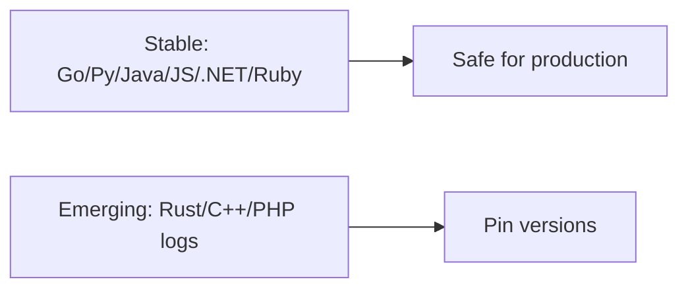

# Language Stability Matrix

## What It Is
A per-language summary of **OpenTelemetry stability** across signals. Stability varies by language and signal.

## Why It Exists
Teams need to know what's safe to build on in their language of choice.

## Matrix (indicative)
| Language | Traces | Metrics | Logs | Notes |
|----------|--------|---------|------|-------|
| Go | Stable | Stable | Stable | Strong contrib ecosystem |
| Python | Stable | Stable | Stable | Best auto-instr story |
| Java | Stable | Stable | Stable | Best zero-code agent |
| JS/TS | Stable | Stable | Stable | Node + browser |
| .NET | Stable | Stable | Stable | Strong ASP.NET integration |
| Rust | Stable (traces) | Emerging | Emerging | Check crate versions |
| C++ | Stable (traces) | Emerging | Emerging | Build-from-source |
| Ruby | Stable | Stable | Stable | Good Rails support |
| PHP | Stable | Stable | Emerging | Extension-based auto |

> Always verify against the official [version & stability doc](../docs/version-stability.md) and each repo's release notes.

## Architecture

## Best Practices
- Build production on Stable signals
- Pin SDK versions per language
- Watch release notes for promotions

## Related Concepts
- [Stability Levels (core)](../01-core-concepts/stability-levels.md)
- [Version & Stability (docs)](../docs/version-stability.md)
