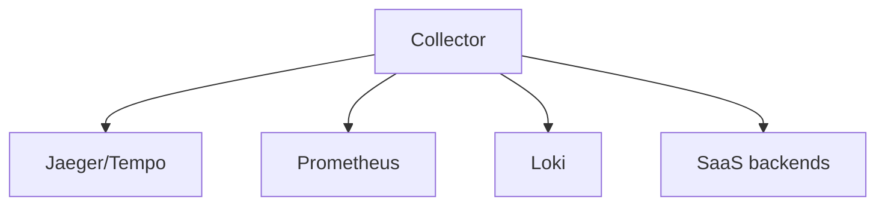

# 10 · Exporters & Backends

> Where your telemetry ends up. These are the **backends** OpenTelemetry exports to — either directly or (recommended) via the Collector. OTLP-native backends accept OTLP directly; others use dedicated exporters. **For logging-focused deployments, see the [Kibana/Elastic](../19-kibana-elastic/README.md) and [Coralogix](../20-coralogix/README.md) sections.**

## Topics in this section

| Document | Summary |
|----------|---------|
| [jaeger.md](jaeger.md) | Tracing backend (CNCF) |
| [tempo.md](tempo.md) | Grafana tracing backend |
| [prometheus.md](prometheus.md) | Metrics TSDB |
| [loki.md](loki.md) | Logs backend |
| [grafana.md](grafana.md) | Unified visualization |
| [honeycomb.md](honeycomb.md) | SaaS observability |
| [lightstep.md](lightstep.md) | SaaS (now Chronosphere) |
| [datadog.md](datadog.md) | SaaS APM |
| [newrelic.md](newrelic.md) | SaaS APM |
| [elastic.md](elastic.md) | Elastic Observability / Kibana |
| [coralogix.md](coralogix.md) | Coralogix (TCO-optimized logging) |
| [signalfx-splunk.md](signalfx-splunk.md) | Splunk Observability |

See the [main README](../README.md) for the full map.
