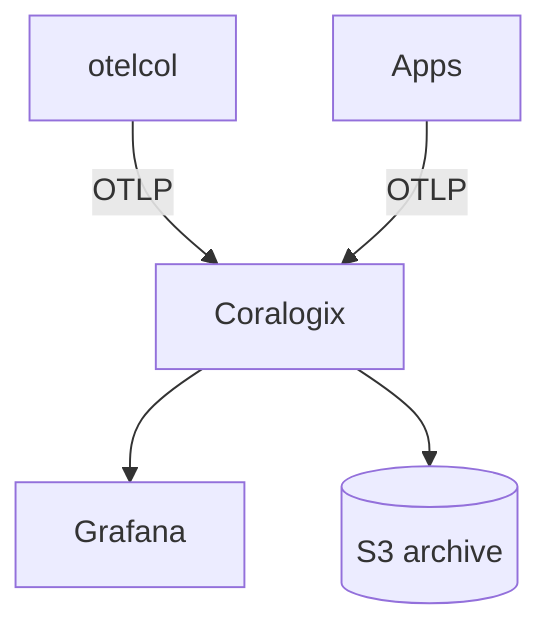

# Coralogix

## What It Is
**Coralogix** is a SaaS observability platform with a strong **logging** focus and a TCO-optimized architecture. It ingests OpenTelemetry (OTLP) natively alongside traditional log shippers.

## Why It Exists
Coralogix lets teams standardize on OTel SDKs while keeping a cost-efficient logging backend — indexing only what you alert/visualize on, archiving the rest.

## Architecture


## When to Use It
- Cost-sensitive, high-volume logging
- Want logs + metrics + traces in one SaaS
- Teams already on Grafana

## Code Example (Collector exporter)
```yaml
exporters:
  otlphttp/coralogix:
    endpoint: https://ingress.<region>.coralogix.com:443
    headers:
      Authorization: "Bearer ${env:CORALOGIX_KEY}"
      CX-Application: "checkout"
      CX-Subsystem: "api"
```

## Best Practices
- Set `service.name` → Coralogix Application
- Use the Collector for buffering/retry
- Use TCO Optimizer + archiving for cost
- Correlate `trace_id` across signals

## Related Concepts
- [Coralogix section](../20-coralogix/README.md)
- [OTLP in Coralogix](../20-coralogix/otlp-coralogix.md)
- [TCO Optimizer](../20-coralogix/tco-optimizer.md)
