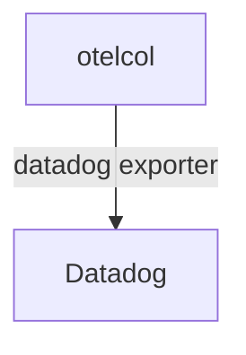

# Datadog

## What It Is
**Datadog** is a SaaS observability platform that ingests OpenTelemetry via its **Datadog Exporter** (or OTLP ingestion), mapping OTel signals to Datadog's model.

## Why It Exists
Many teams run OTel SDKs but want Datadog's UI/alerting; the Datadog exporter bridges OTel → Datadog without a separate agent.

## Architecture


## When to Use It
- Standardize on OTel SDKs, use Datadog backend
- Gradual migration from Datadog APM agent

## Code Example
```yaml
exporters:
  datadog:
    api:
      key: ${env:DD_API_KEY}
      site: datadoghq.com
    traces: { endpoint: 0.0.0.0:4317 }
```

## Best Practices
- Use the Collector Datadog exporter (not per-app)
- Map `service.name`/`resource` consistently
- Be aware of attribute/semconv translation differences

## Related Concepts
- [Migration](../08-instrumentation/migration.md)
- [Exporters (arch)](../02-architecture/exporters.md)
