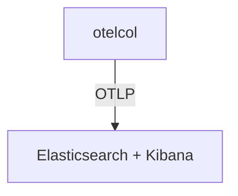

# Elastic Observability

## What It Is
**Elastic Observability** (Elasticsearch + Kibana) ingests OTel data via the Elastic exporter or OTLP, unifying traces, metrics, and logs in the Elastic Stack.

## Why It Exists
Teams already on Elastic can adopt OTel SDKs and feed the Elastic backend directly.

## Architecture


## When to Use It
- Existing Elastic Stack investments
- Unified search + observability

## Code Example
```yaml
exporters:
  otlphttp/elastic:
    endpoint: https://elastic.example:443
    headers: { "Authorization": "Bearer ${env:ES_TOKEN}" }
```

## Best Practices
- Use Elastic's OTLP endpoint for traces/metrics/logs
- Map `service.name` to Elastic's service entity
- Correlate via `trace.id` in Kibana

## Related Concepts
- [Loki](loki.md)
- [Grafana](grafana.md)
