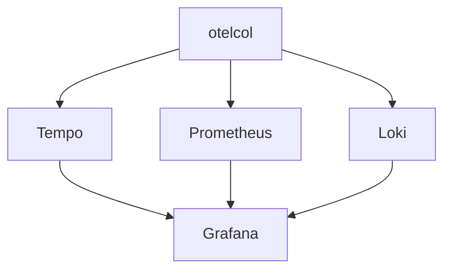

# Grafana

## What It Is
**Grafana** is the **visualization layer** that ties traces (Tempo), metrics (Prometheus), and logs (Loki) together via `trace_id` correlation.

## Why It Exists
Observability value comes from unified exploration; Grafana is the dashboard/explore UI for the OTel pipeline.

## Architecture (LGTM)

## When to Use It
- Self-hosted unified observability
- Dashboards, Explore, alerting

## Best Practices
- Enable `trace_id` linking across datasources
- Use exemplars to pivot metrics → traces
- Build SLO dashboards from RED/USE metrics

## Related Concepts
- [Tempo](tempo.md)
- [Prometheus](prometheus.md)
- [Loki](loki.md)
- [Observability Practice](../14-observability-practice/README.md)
