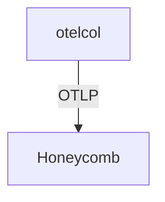

# Honeycomb

## What It Is
**Honeycomb** is a SaaS **observability backend** built around high-cardinality event/trace analysis. It ingests OTLP natively.

## Why It Exists
Honeycomb excels at "unknown-unknown" debugging using heavily attributed trace data — a natural fit for OTel's rich attributes.

## Architecture


## When to Use It
- High-cardinality, exploratory debugging
- SaaS without self-hosting overhead

## Code Example
```yaml
exporters:
  otlphttp/honeycomb:
    endpoint: https://api.honeycomb.io
    headers: { "x-honeycomb-team": "${env:HONEYCOMB_KEY}" }
```

## Best Practices
- Send rich attributes (Honeycomb thrives on them)
- Use the `x-honeycomb-dataset` header for dataset routing
- Sample with tail sampling, keep errors

## Related Concepts
- [Exporters (arch)](../02-architecture/exporters.md)
- [Attributes (core)](../01-core-concepts/attributes.md)
