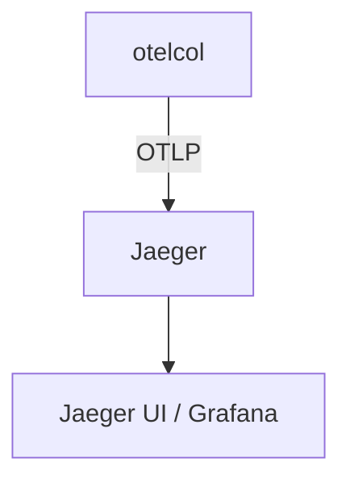

# Jaeger

## What It Is
**Jaeger** is a CNCF graduated **distributed tracing backend**. Modern Jaeger accepts OTLP directly (no collector shim needed) and stores/queries traces.

## Why It Exists
Jaeger was the reference tracing backend; it now natively speaks OTLP, making it a natural OTel destination.

## Architecture


## When to Use It
- Self-hosted tracing
- Kubernetes-native deployments (Jaeger Operator)

## Code Example (Collector exporter)
```yaml
exporters:
  otlp/jaeger:
    endpoint: jaeger-collector:4317
    tls: { insecure: true }
service:
  pipelines:
    traces: { receivers: [otlp], processors: [batch], exporters: [otlp/jaeger] }
```

## Best Practices
- Use Jaeger's native OTLP port (4317)
- Choose storage (Elasticsearch/Cassandra/badger) by scale
- Pair with Prometheus + Loki for full stack

## Related Concepts
- [Tempo](tempo.md)
- [Collector Exporters Deep](../06-collector/exporters-deep.md)
