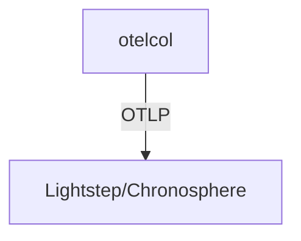

# Lightstep (Chronosphere)

## What It Is
**Lightstep** (now part of **Chronosphere**) is a SaaS observability platform that ingests OTLP and focuses on distributed tracing and SLOs at scale.

## Why It Exists
Lightstep pioneered production-scale tracing analysis; OTLP makes it a drop-in OTel backend.

## Architecture


## When to Use It
- Enterprise tracing + SLOs as a service
- Large, complex microservice environments

## Code Example
```yaml
exporters:
  otlphttp/lightstep:
    endpoint: https://ingest.lightstep.com:443
    headers: { "lightstep-access-token": "${env:LS_TOKEN}" }
```

## Best Practices
- Use the access token via env/secret
- Define SLOs on RED metrics derived from spans
- Tail-sample to control cost

## Related Concepts
- [Sampling](../02-architecture/sampling.md)
- [Observability Practice](../14-observability-practice/README.md)
