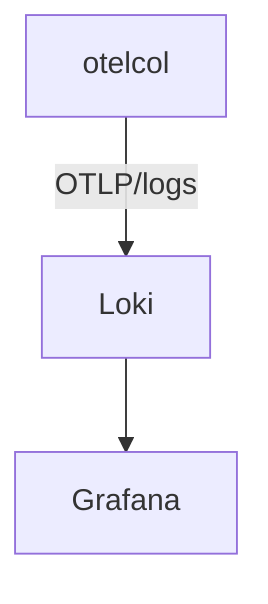

# Loki

## What It Is
**Grafana Loki** is a **logs aggregation backend** optimized for indexing metadata (labels), not full text. OTel logs export to Loki via the `loki` exporter.

## Why It Exists
Loki pairs with Tempo/Prometheus for the LGTM stack; it ingests OTel logs and links them by `trace_id`/`service.name`.

## Architecture


## When to Use It
- Centralized logs in the Grafana stack
- Cost-effective log storage (label-indexed)

## Code Example
```yaml
exporters:
  loki:
    endpoint: http://loki:3100/loki/api/v1/push
    labels: { resource: [service.name, deployment.environment] }
```

## Best Practices
- Map resource attributes to Loki labels (low-cardinality)
- Keep high-cardinality in the log body/attributes, not labels
- Correlate with traces via `trace_id` in Grafana

## Related Concepts
- [Logs](../05-logs/README.md)
- [Tempo](tempo.md)
- [Grafana](grafana.md)
