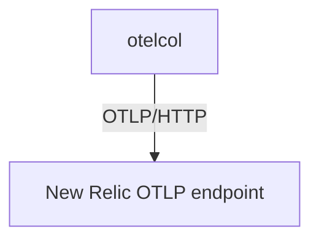

# New Relic

## What It Is
**New Relic** is a SaaS observability platform that ingests OTLP directly (via its OTLP endpoint) or through the New Relic exporter.

## Why It Exists
Teams using OTel SDKs can send data to New Relic without the New Relic agent, avoiding lock-in at the SDK layer.

## Architecture


## When to Use It
- OTel SDKs + New Relic backend
- Unified APM/traces/metrics/logs in New Relic

## Code Example
```yaml
exporters:
  otlphttp/newrelic:
    endpoint: https://otlp.nr-data.net:4318
    headers: { "api-key": "${env:NR_LICENSE_KEY}" }
```

## Best Practices
- Use OTLP/HTTP to the New Relic endpoint
- Set `service.name` for entity mapping
- Leverage New Relic's OTLP attribute support

## Related Concepts
- [Exporters (arch)](../02-architecture/exporters.md)
- [Migration](../08-instrumentation/migration.md)
