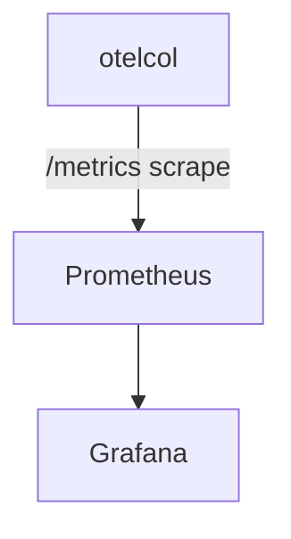

# Prometheus

## What It Is
**Prometheus** is the de-facto **metrics backend/TSDB**. OTel metrics are exported to Prometheus via the Collector's `prometheus` exporter (which exposes a scrape endpoint).

## Why It Exists
Prometheus is the standard for metrics storage/querying; OTel feeds it via a scrape endpoint, unifying metrics tooling.

## Architecture


## When to Use It
- Metrics storage & PromQL querying
- Self-hosted, Kubernetes-native monitoring

## Code Example
```yaml
exporters:
  prometheus:
    endpoint: 0.0.0.0:8889
service:
  pipelines:
    metrics: { receivers: [otlp], processors: [batch], exporters: [prometheus] }
```

## Best Practices
- Watch metric cardinality (Prometheus is costly at scale)
- Use Recording/Alerting rules
- Combine with spanmetrics connector for RED metrics

## Common Issues & Solutions
| Issue | Fix |
|-------|-----|
| Cardinality explosion | Drop attributes in Views/processor |
| Scrape failures | Check exporter port/firewall |

## Related Concepts
- [Metrics](../04-metrics/README.md)
- [SpanMetrics connector](../02-architecture/connectors.md)
- [Tempo](tempo.md)
