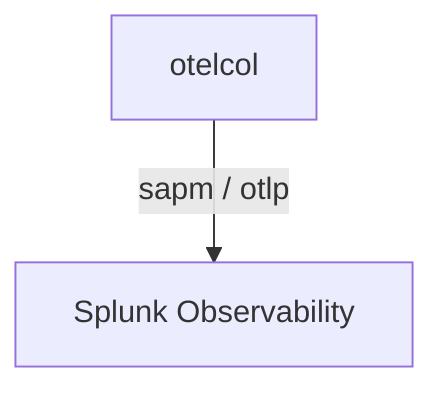

# Splunk Observability (SignalFx)

## What It Is
**Splunk Observability Cloud** (formerly SignalFx) ingests OpenTelemetry via its Smart Agent/Collector exporter or OTLP, supporting traces, metrics, and logs.

## Why It Exists
Enterprise Splunk users can standardize on OTel while keeping Splunk's backend and analytics.

## Architecture


## When to Use It
- Existing Splunk Observability investment
- Enterprise APM + infra monitoring

## Code Example
```yaml
exporters:
  sapm:
    access_token: ${env:SPLUNK_TOKEN}
    endpoint: https://ingest.us0.signalfx.com/v2/trace
```

## Best Practices
- Use the Collector with Splunk exporter (not per-app)
- Set `deployment.environment` for environment scoping
- Map metrics to Splunk's MTS model

## Related Concepts
- [Exporters (arch)](../02-architecture/exporters.md)
- [Metric Streams](../04-metrics/metric-streams.md)
