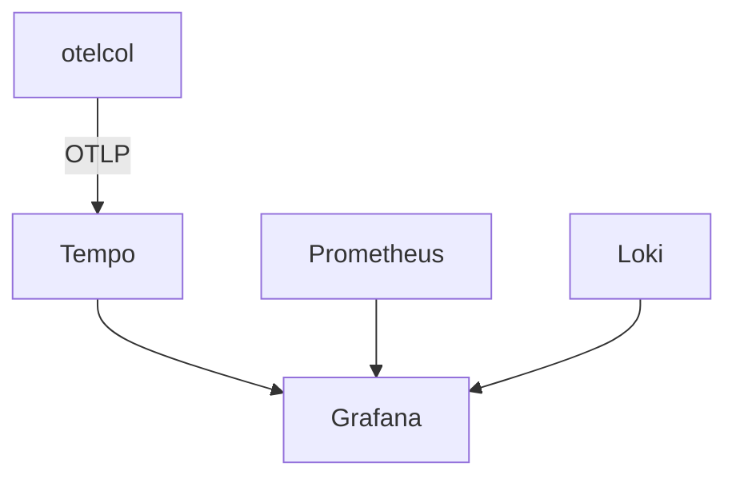

# Tempo

## What It Is
**Grafana Tempo** is a **high-scale, cost-effective distributed tracing backend** designed to work with Grafana, Prometheus, and Loki. It ingests OTLP natively.

## Why It Exists
Tempo stores only traces (cheap object storage) and correlates with metrics/logs via `trace_id`, fitting the Grafana LGTM stack.

## Architecture


## When to Use It
- Grafana-centric observability
- Very large trace volumes (object storage)

## Code Example
```yaml
exporters:
  otlp/tempo:
    endpoint: tempo:4317
    tls: { insecure: true }
```

## Best Practices
- Use exemplars to jump metrics → Tempo traces
- Use Loki for trace-linked logs in Grafana
- Choose backend storage (S3/GCS) for scale

## Related Concepts
- [Grafana](grafana.md)
- [Prometheus](prometheus.md)
- [Loki](loki.md)
