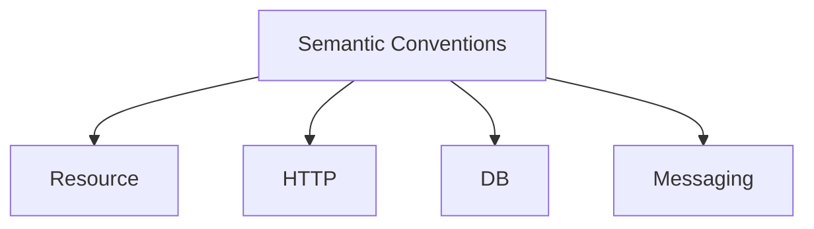

# 11 · Semantic Conventions

> **Standardized attribute names** so telemetry is comparable across services, languages, and backends. Follow these instead of inventing your own keys.

## Topics in this section

| Document | Summary |
|----------|---------|
| [resource.md](resource.md) | `service.*`, `deployment.*`, `cloud.*`, `host.*` |
| [http.md](http.md) | `http.method`, `http.route`, `http.status_code` |
| [db.md](db.md) | `db.system`, `db.statement`, `db.name` |
| [messaging.md](messaging.md) | `messaging.system`, `messaging.destination` |
| [rpc.md](rpc.md) | `rpc.system`, `rpc.service`, `rpc.method` |
| [faas.md](faas.md) | `faas.name`, `faas.trigger` |
| [system.md](system.md) | `system.cpu`, `system.memory`, `process.*` |
| [k8s.md](k8s.md) | `k8s.*` resource attributes |
| [exceptions.md](exceptions.md) | `exception.type`, `exception.message` |
| [stability.md](stability.md) | Stability of conventions |

See the [main README](../README.md) for the full map.
