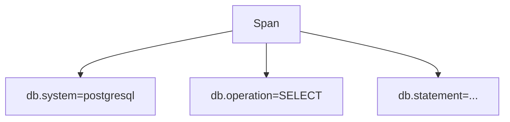

# Database Semantic Conventions

## What It Is
Standard attributes for **database client spans**: which system, statement, and operation.

## Why It Exists
DB calls are top latency contributors; standard attributes enable universal DB dashboards.

## Key Attributes
| Attribute | Example |
|-----------|---------|
| `db.system` | `"postgresql"` |
| `db.name` | `"orders"` |
| `db.operation` | `"SELECT"` |
| `db.statement` | `"SELECT * FROM users"` (sensitive!) |
| `db.collection.name` / `db.sql.table` | `"users"` |
| `db.query.text` | the query (be careful) |

## Architecture

## When to Use It
- Every DB client call span
- Set `db.system` + `db.name` always; `db.statement` cautiously

## Best Practices
- Avoid capturing full statements with literals (PII/SQLi exposure)
- Prefer `db.operation` + table over full SQL
- Redact `db.statement` in the Collector if needed

## Related Concepts
- [Attributes (core)](../01-core-concepts/attributes.md)
- [Collector Processors Deep](../06-collector/processors-deep.md)
