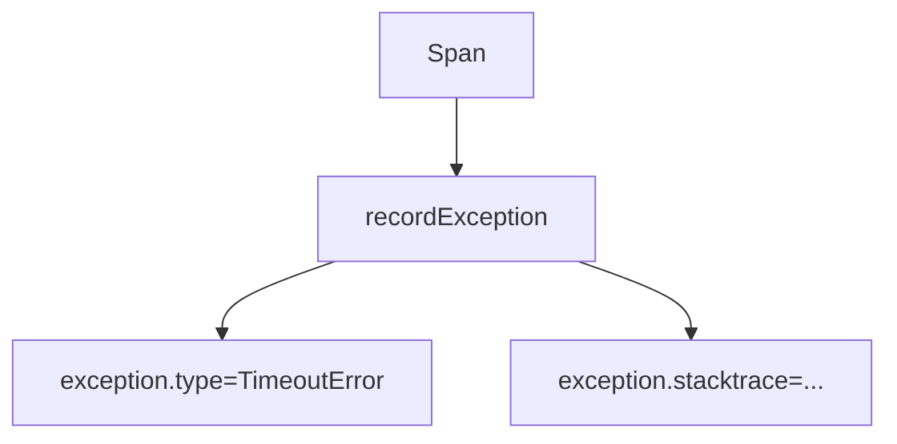

# Exception Semantic Conventions

## What It Is
Standard attributes recorded when an operation throws, used by `recordException` / log errors.

## Why It Exists
Consistent error attributes let backends group, alert, and correlate failures uniformly.

## Key Attributes
| Attribute | Example |
|-----------|---------|
| `exception.type` | `"TimeoutError"` |
| `exception.message` | `"connection timed out"` |
| `exception.stacktrace` | full stack |
| `error.type` (events/logs) | `"db.timeout"` |

## Architecture

## When to Use It
- On caught exceptions (span `recordException`)
- In error log records (`error.type`)

## Best Practices
- Pair `recordException` with `span.SetStatus(ERROR)`
- Cap stacktrace size / redact sensitive frames
- Use `exception.type` (not message) for grouping

## Related Concepts
- [Span Status](../03-traces/span-status.md)
- [Attributes & Events](../03-traces/attributes-and-events.md)
- [Logs](../05-logs/README.md)
