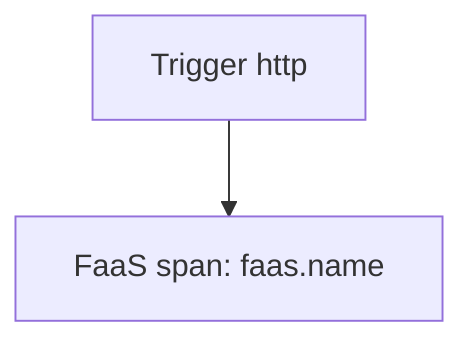

# FaaS Semantic Conventions

## What It Is
Standard attributes for **serverless / Function-as-a-Service** executions (AWS Lambda, Cloud Functions, Azure Functions).

## Why It Exists
FaaS invocations need context: which function, trigger type, execution id, to correlate telemetry.

## Key Attributes
| Attribute | Example |
|-----------|---------|
| `faas.name` | `"image-resizer"` |
| `faas.version` | `"$LATEST"` |
| `faas.trigger` | `"http"` / `"sqs"` / `"timer"` |
| `faas.execution` | invocation id |
| `cloud.account.id` | AWS account |

## Architecture

## When to Use It
- Lambda / Cloud Function / Azure Function spans
- Set trigger type for routing/tracing

## Best Practices
- Use provider-native OTel layers (e.g., Lambda OTel extension)
- Correlate cold starts via `faas.execution`
- Export via a Collector (avoid creds in function)

## Related Concepts
- [Cloud Integrations (docs)](../docs/cloud-integrations.md)
- [Resource Conventions](resource.md)
