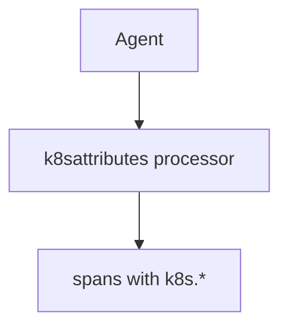

# Kubernetes Semantic Conventions

## What It Is
Standard `k8s.*` resource attributes added to telemetry, typically by the Collector's `k8sattributes` processor or resource detectors.

## Why It Exists
In Kubernetes you need pod/namespace/node context on every span/metric/log to filter and group effectively.

## Key Attributes
| Attribute | Example |
|-----------|---------|
| `k8s.cluster.name` | `"prod-us"` |
| `k8s.namespace.name` | `"payments"` |
| `k8s.deployment.name` | `"checkout"` |
| `k8s.pod.name` | `"checkout-7d9f"` |
| `k8s.node.name` | `"node-3"` |
| `k8s.container.name` | `"checkout"` |

## Architecture

## When to Use It
- All K8s workloads (add via `k8sattributes`)
- Enables per-namespace/pod dashboards

## Best Practices
- Add `k8sattributes` on the **agent** tier
- Don't add all attributes to metrics (cardinality)
- Pair with `deployment.environment`

## Related Concepts
- [Kubernetes Deployment](../13-kubernetes-deployment/README.md)
- [Resource Conventions](resource.md)
