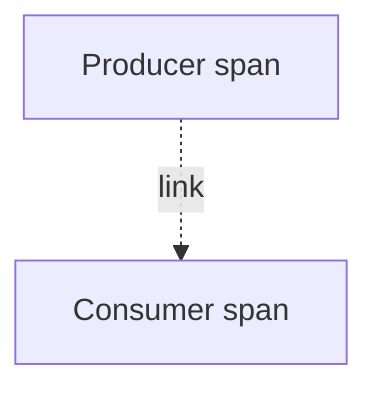

# Messaging Semantic Conventions

## What It Is
Standard attributes for **messaging systems** (Kafka, RabbitMQ, SQS, Pub/Sub): system, destination, operation.

## Why It Exists
Async messaging breaks simple request flows; standard attributes let you trace producers/consumers and use Links.

## Key Attributes
| Attribute | Example |
|-----------|---------|
| `messaging.system` | `"kafka"` |
| `messaging.destination.name` | `"orders"` |
| `messaging.operation` | `"publish"` / `"receive"` / `"process"` |
| `messaging.message.id` | id |
| `messaging.consumer.group` | `"checkout-workers"` |

## Architecture

## When to Use It
- Publish/receive/process spans
- Add a **Link** from consumer to producer trace

## Best Practices
- Use `messaging.operation` to distinguish roles
- Link consumer span to producer's trace context
- Keep `message.id` low-volume; avoid as a metric dimension

## Related Concepts
- [Links](../03-traces/links.md)
- [Cross-Process Propagation](../07-context-propagation/cross-process.md)
