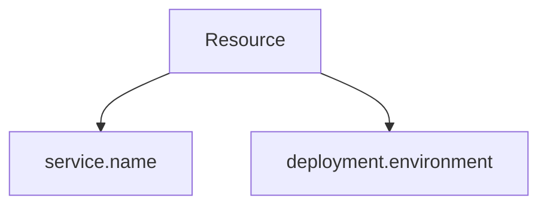

# Resource Semantic Conventions

## What It Is
Standard attributes describing the **resource** (entity) producing telemetry: `service.*`, `deployment.*`, `cloud.*`, `host.*`.

## Why It Exists
Without standard resource keys, grouping/filtering by service or environment is inconsistent.

## Key Attributes
| Attribute | Example |
|-----------|---------|
| `service.name` | `"checkout"` (required-ish) |
| `service.version` | `"1.2.3"` |
| `service.namespace` | `"payments"` |
| `deployment.environment` | `"production"` |
| `cloud.provider` | `"aws"` |
| `cloud.region` | `"us-east-1"` |
| `host.name` | `"node-7"` |
| `telemetry.sdk.name` | `"opentelemetry"` |

## Architecture

## When to Use It
- Always set `service.name`
- Separate prod/staging with `deployment.environment`
- Let detectors fill cloud/host automatically

## Best Practices
- Use resource detectors (auto) where possible
- Keep Resource low-cardinality
- Never put request data here

## Related Concepts
- [Resource (core)](../01-core-concepts/resource.md)
- [K8s Conventions](k8s.md)
