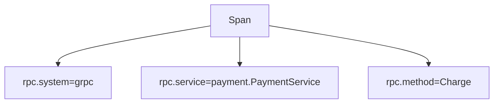

# RPC Semantic Conventions

## What It Is
Standard attributes for **RPC calls** (gRPC, custom RPC): system, service, method, status.

## Why It Exists
RPC is common in microservices (esp. gRPC); standard attributes enable consistent latency/error tracking.

## Key Attributes
| Attribute | Example |
|-----------|---------|
| `rpc.system` | `"grpc"` |
| `rpc.service` | `"payment.PaymentService"` |
| `rpc.method` | `"Charge"` |
| `rpc.grpc.status_code` | `"OK"` / `"UNAVAILABLE"` |
| `server.address` / `server.port` | target |

## Architecture

## When to Use It
- gRPC and other RPC client/server spans
- Map `rpc.grpc.status_code` to span status

## Best Practices
- Set `rpc.method` (not full path) to bound cardinality
- Mark non-OK gRPC status as ERROR
- Pair with `server.address` for topology

## Related Concepts
- [HTTP Conventions](http.md)
- [Span Status](../03-traces/span-status.md)
