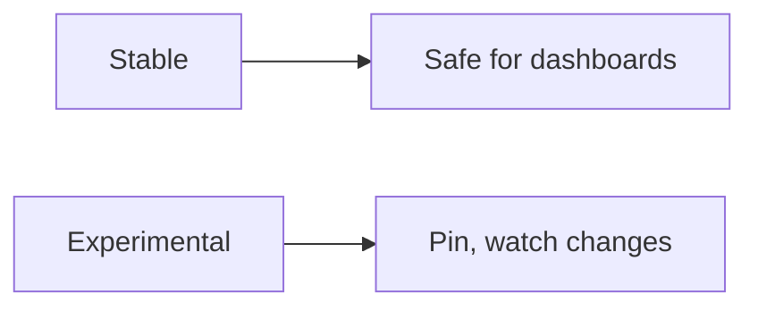

# Semantic Conventions Stability

## What It Is
Status of **semantic conventions** — some are Stable, some Experimental (may change naming).

## Why It Exists
Conventions evolve; knowing stability prevents building brittle dashboards on experimental keys.

## Status (indicative)
| Group | Stability |
|-------|-----------|
| Resource (`service.*`, `cloud.*`, `host.*`) | Stable |
| HTTP | Stable (with recent renames; `http.request.method`) |
| DB | Stable |
| Messaging | Stable |
| RPC / gRPC | Stable |
| FaaS | Stable |
| System/process | Stable |
| Exceptions | Stable |
| Some newer (gen-ai, browser) | Experimental |

## Architecture

## Best Practices
- Prefer stable conventions
- Use semconv library constants (they track versions)
- Watch release notes for renames (e.g., `http.method` → `http.request.method`)

## Related Concepts
- [Stability Levels (core)](../01-core-concepts/stability-levels.md)
- [Semantic Conventions (core)](../01-core-concepts/semantic-conventions.md)
