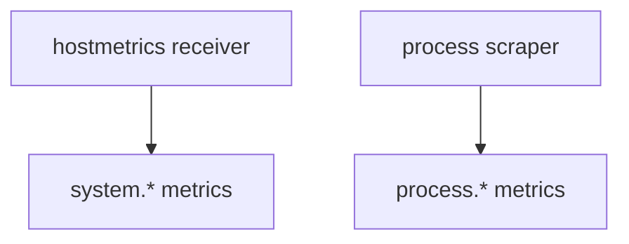

# System Semantic Conventions

## What It Is
Standard attributes for **system/process metrics**: CPU, memory, disk, network, and the process itself.

## Why It Exists
Infra observability needs consistent names so dashboards work everywhere.

## Key Attributes / Metrics
| Attribute / Metric | Example |
|--------------------|---------|
| `system.cpu.usage` | per-core utilization |
| `system.memory.usage` (state: used/free) | bytes |
| `system.disk.io` | read/write bytes |
| `system.network.io` | in/out bytes |
| `process.cpu.usage`, `process.memory.usage` | per-process |
| `process.pid`, `process.command` | identity |

## Architecture

## When to Use It
- Host/process monitoring (agent tier)
- Complement app metrics with resource metrics

## Best Practices
- Collect via Collector `hostmetrics` receiver
- Label by `host.name` / `service.name`
- Alert on `system.memory.usage` state=used

## Related Concepts
- [Metrics](../04-metrics/README.md)
- [Collectors Receivers](../02-architecture/receivers.md)
