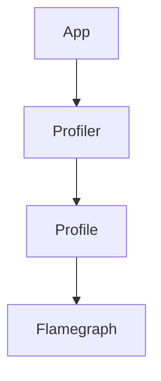

# 12 · Profiling

> **Continuous Profiling** is the emerging fourth signal in OpenTelemetry: sampling where CPU/memory time is spent, and correlating it with traces. Still experimental but rapidly maturing.

## Topics in this section

| Document | Summary |
|----------|---------|
| [continuous-profiling.md](continuous-profiling.md) | Always-on, low-overhead profiling |
| [pprof.md](pprof.md) | The pprof profile format |
| [ebpf-profiling.md](ebpf-profiling.md) | Kernel-level CPU profiling |
| [otlp-profiles.md](otlp-profiles.md) | OTLP profile signal (emerging) |
| [flamegraphs.md](flamegraphs.md) | Visualizing profiles |

See the [main README](../README.md) for the full map.
