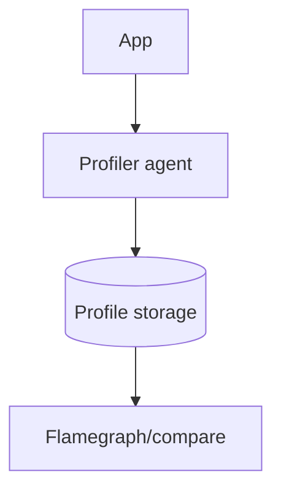

# Continuous Profiling

## What It Is
**Continuous profiling** collects stack samples from production **constantly** (not just on demand), revealing where CPU and memory are spent over time.

## Why It Exists
Flamegraphs on demand are too late for production issues. Continuous, low-overhead profiling lets you answer "why is this service using so much CPU?" after the fact.

## Key Ideas
- Sampled (e.g., 1–100 Hz), not full instrumentation
- Low overhead (<1–5%)
- Correlate with traces via span/thread context
- Stored as profiles over time, queryable

## Architecture

## When to Use It
- Performance optimization in production
- Diagnosing CPU/memory hotspots
- Comparing profiles across deploys

## Best Practices
- Keep sampling low-overhead
- Correlate profiles with traces (span context)
- Use differential/comparison views across versions

## Related Concepts
- [pprof](pprof.md)
- [OTLP Profiles](otlp-profiles.md)
- [Flamegraphs](flamegraphs.md)
