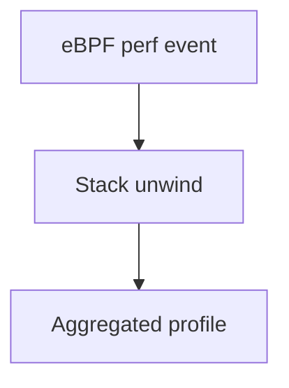

# eBPF Profiling

## What It Is
**eBPF-based profiling** samples stacks at the **kernel level**, capturing CPU usage across all processes/languages without app changes.

## Why It Exists
Language-specific profilers miss cross-language and native code; eBPF gives a unified, code-free CPU profile of the whole host.

## How It Works

- Attaches to perf events (CPU cycles)
- Unwinds user + kernel stacks
- Emits pprof/OTel-compatible profiles

## When to Use It
- Host-wide CPU profiling
- Uninstrumentable or polyglot workloads
- Supplementing SDK profilers

## Caveats
- Linux-only, needs privileges
- Stack unwinding can be imperfect for some runtimes

## Related Concepts
- [eBPF Instrumentation](../08-instrumentation/ebpf.md)
- [Continuous Profiling](continuous-profiling.md)
