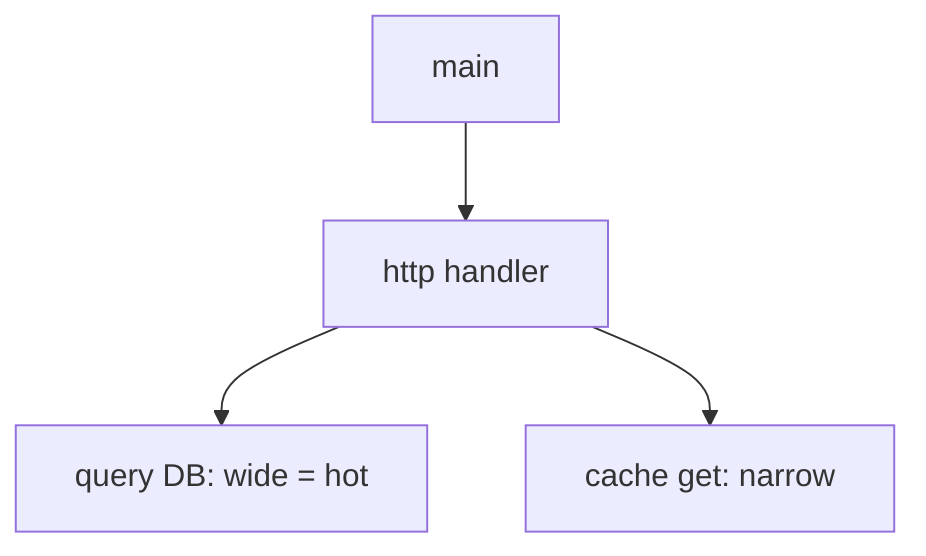

# Flamegraphs

## What It Is
A **flamegraph** is a visualization of aggregated stack samples: width = time spent, stacks grow upward, making hotspots obvious.

## Why It Exists
Raw profiles are unreadable; flamegraphs turn thousands of samples into an instantly scannable "where does time go" view.

## Reading a Flamegraph

- **Wider box** = more CPU/time
- Click to zoom into a subtree
- Compare (differential) two profiles to find regressions

## When to Use It
- Diagnosing CPU/memory hotspots
- Pre/post deploy performance comparison

## Best Practices
- Pair with traces: "during this slow span, what was hot?"
- Use differential flamegraphs for regressions
- Capture during the incident window

## Related Concepts
- [Continuous Profiling](continuous-profiling.md)
- [pprof](pprof.md)
