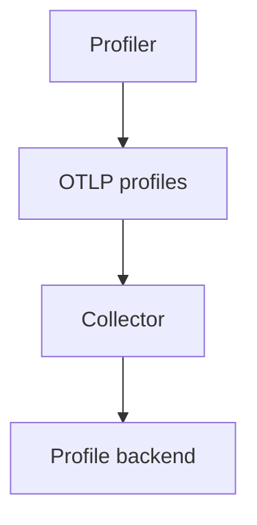

# OTLP Profiles

## What It Is
**OTLP Profiles** is the **emerging OTLP signal** for transmitting profiling data alongside traces/metrics/logs, using a profile data model (based on pprof).

## Why It Exists
To make profiling first-class in OTel: one pipeline, one Collector, one backend — and to correlate profiles with traces via `profile_id`/`span` links.

## Status
- **Experimental** in OTel (profiling signal being standardized)
- Data model based on pprof protobuf
- Supported by some backends (e.g., Pyroscope/Grafana, others)

## Architecture

## When to Use It
- When your backend supports OTLP profiles
- To unify profiling into the OTel pipeline

## Best Practices
- Pin versions (experimental)
- Correlate with traces for "show profile during this span"
- Keep sampling overhead low

## Related Concepts
- [OTLP (core)](../01-core-concepts/otlp.md)
- [Continuous Profiling](continuous-profiling.md)
- [pprof](pprof.md)
