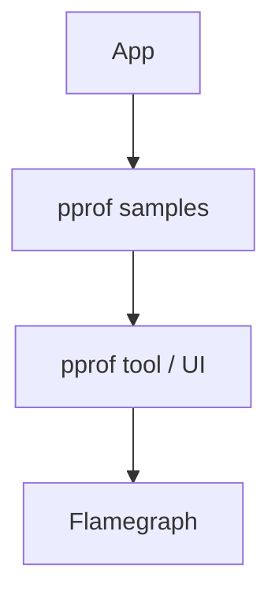

# pprof

## What It Is
**pprof** is the widely-used **profile data format/tool** (from Go) for representing CPU, heap, and block profiles as sampled stack traces.

## Why It Exists
pprof is the de-facto interchange format for profiles; OTel profiling builds on it for representation and tooling compatibility.

## Profile Types
| Type | Measures |
|------|----------|
| cpu | On-CPU time |
| heap | Memory allocations / in-use |
| goroutine / thread | Concurrency |
| block / mutex | Contention |

## Architecture


## When to Use It
- Go services (native pprof endpoint)
- Any system emitting pprof-compatible profiles

## Code Example (Go)
```go
import _ "net/http/pprof"
// http://localhost:6060/debug/pprof/profile?seconds=30
```

## Best Practices
- Expose pprof on an internal, secured port
- Use flamegraphs to read profiles
- Convert to OTel profiles where supported

## Related Concepts
- [Flamegraphs](flamegraphs.md)
- [Continuous Profiling](continuous-profiling.md)
