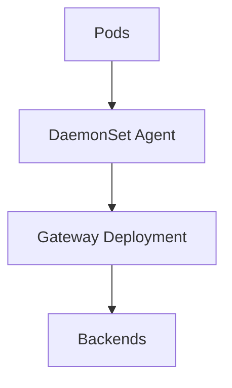

# 13 · Kubernetes Deployment

> Running OpenTelemetry on **Kubernetes**: the OTel Operator, Helm charts, DaemonSet agents, gateway Deployments, custom CRDs, and automatic injection of instrumentation.

## Topics in this section

| Document | Summary |
|----------|---------|
| [operator.md](operator.md) | OpenTelemetry Operator & CRDs |
| [helm.md](helm.md) | Helm charts for Collector |
| [daemonset-agent.md](daemonset-agent.md) | Node-level agent collection |
| [gateway.md](gateway.md) | Centralized gateway tier |
| [otel-crds.md](otel-crds.md) | OpenTelemetryCollector / Instrumentation CRDs |
| [auto-instrumentation-k8s.md](auto-instrumentation-k8s.md) | Zero-code injection via Operator |
| [sidecar-vs-daemonset.md](sidecar-vs-daemonset.md) | Placement trade-offs |
| [best-practices-k8s.md](best-practices-k8s.md) | Production guidance |

See the [main README](../README.md) for the full map.
